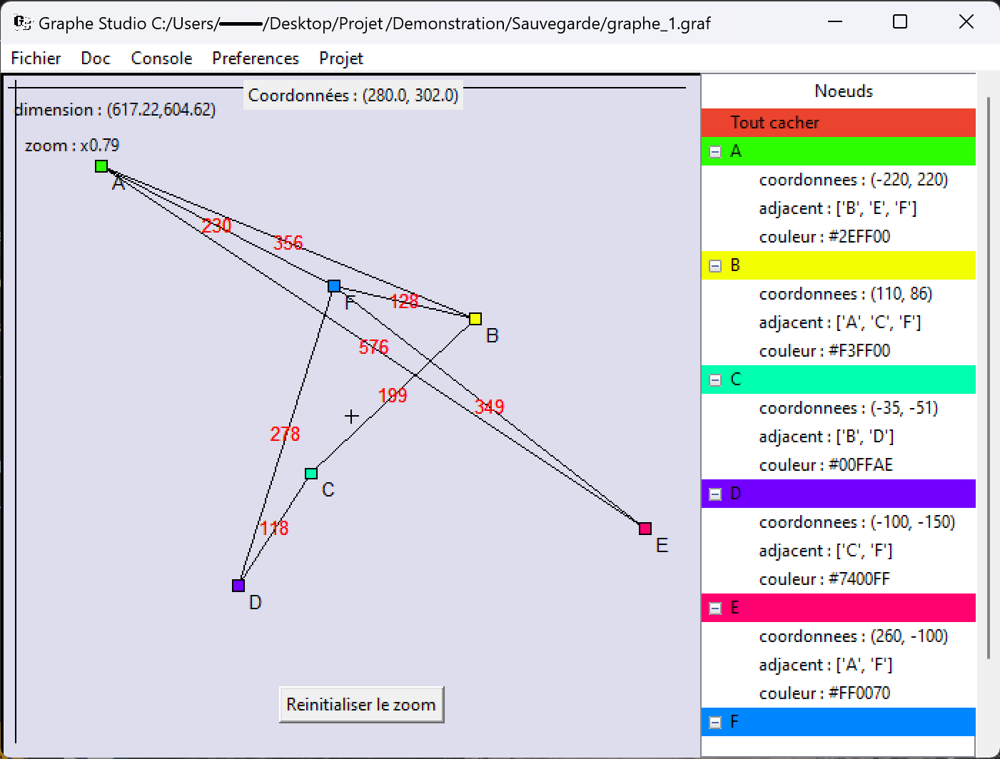
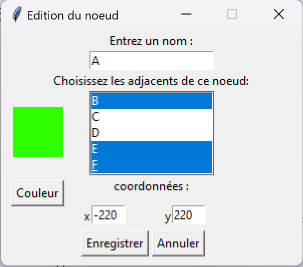
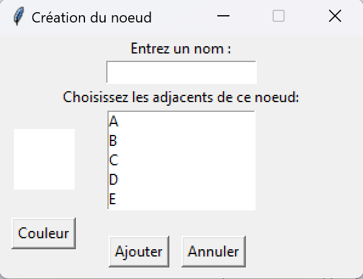

# Graphe Studio
# 

  
  
  

Graphe Studio est un logiciel permettant la création de graphe orienté comme non orienté 
de manière simple ,rapide et efficace destiné à de multiple usage .
Ce logiciel permet non seulement de créer des graphes mais aussi d'intéragire avec en 
appliquant la théorie des graphes .

## Comment utiliser

- Téléchargez Python 3.10 à partir de [ce lien](https://www.python.org/downloads/)
- Téléchargez ce dépôt en utilisant le bouton de téléchargement
- Ouvrez un terminal dans le dossier où vous avez téléchargé le dépôt
- Exécutez la commande `python -m pip install -r requirements.txt` pour installer les dépendances
- Exécutez la commande `python main.py` pour lancer le programme

## Interface
Le logiciel débutera par une fenêtre dans laquelle vous pourrez choisir un type de graphe à crée 
ou vous pouvez directement en importer un .

Suite à cela vous serez accueilli par l'interface principale dans laquelle vous pourrez laisser
libre cours à votre créativité pour votre graphe .Vous y retrouverez un tableur dans lequel il sera afficher les informations
des noeuds de votre graphe puis un canevas qui illustrera votre graphe et permetra d'intéragir avec celui-ci.
Aussi l'interface de l'application a été produit avec la bibliothèque Tkinter et est complétement redimensionnable à votre souhait .

Voici une photo pour illuster l'interface en mettant en valeur les possibilités offertes :

(Dans cette exemple un fichier `.graf` à été importé)

## Interragir avec votre graphe 
Il est possible d'ajouter,de supprimer ou même de modifier un noeud de 
votre graphe à partir de quelques cliques :

- `Clic droit sur un noeud` : Modifier ou supprimer un noeud
- `Clic droit hors d'un noeud` : Ajouter un noeud
- `Clic gauche sur un noeud` : Permet de sélectionner un noeud pour le déplacer

Voici à quoi ressemble ces menus :

  
  

## Menu

Graphe Studio contient une barre de menu dans lequel vous trouverez tout ce qu'il vous faut pour configurer 
vos préférences comme sauvegarder votre graphe .

Voici un tableau contenant les noms et rôles de chaque menu de la barre :

| Menu | rôle |
| ------ | ------ |
| Fichier | Menu permettant de sauvegarder/importer un graphe qui est un fichier `.graf` ,de commmencer un nouveau graphe ,de prendre une photo d'un graphe en `.png` et de quitter le logiciel .|
| Doc | Menu contenant des informations sur les types de graphes que contient le logiciel pour aider.Pratique pour ceux qui ne connaissent pas ou oublié ce que sont les graphes et les différents types de ces derniers présent dans le logiciel .  |
| Console |  Menu permettant l'ouverture de la console ,un outil pour effectuer des opérations avancés sur un graphe comme un parcours en profondeur par exemple .  |
| Preferences | Menu permettant de choisir la couleur du tableur et du canevas ainsi que de faire apparaître ou disparaître des informations sur le canevas pour une meilleurs visibilité .Il donne aussi la possiblité de pouvoir sauvegarder les préférences . |
| Projet | Menu affichant un simple message qui indique que c'est un projet réaliser dans le cadre d'un concours|

  
### Raccourci
Quelques raccourcies sont aussi disponible :
#### Raccourcis pour des sous-menus de la barre de menu
- `ctrl + s` : sauvegarder un graphe
- `ctrl + o` : importer un graphe
- `ctrl + n` : commencer un nouveau graphe

- #### Raccourcis pour la console
- `flèche du haut` : ancienne commande (comme dans une invite de commande)
- `flèche du bas` : supprime la commande
- `entrée` : envoie la commande

## Extension .graf 
Graphe Studio posséde sa propre extension de fichier nommée `.graf` .Cela permet de relier ce type de fichier à l'application
  

